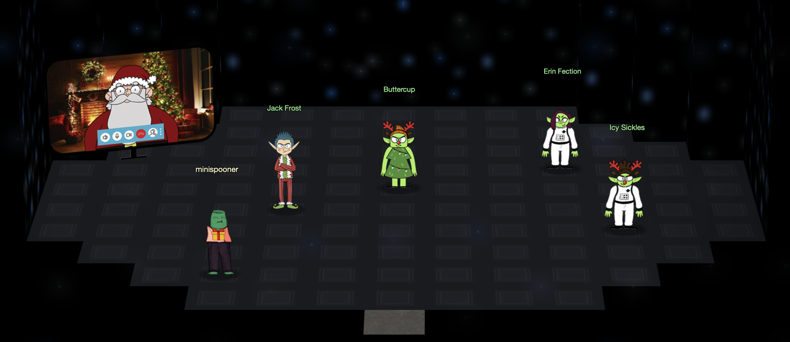
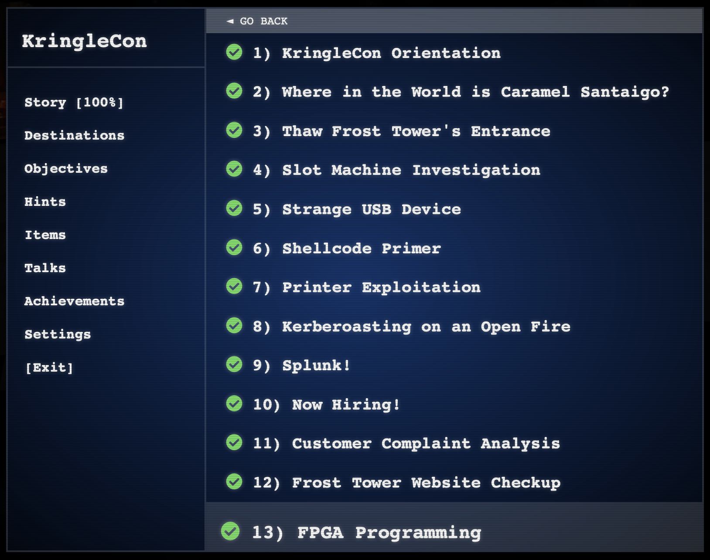

# SANS_KringleCon_2021_Walkthrough
I finished the [2021 SANS KingleCon Holiday Hack](http://2021.kringlecon.com) in 7 days! This repo contains my walkthroughs, hints and answers for the 13 main objectives and most of the side challenges.

## General Approach
When challenge objectives were more of a learning opportunity or lab, my writeups are simply a walkthrough of the lab. However, when recon or exploitation is involved, my writeups are a bit more vague, with hidden hints and answers so you can move at your own pace without spoilers (in most cases).

## Table of Contents
[1 - Orientation](1%20-%20Orientation.md)\
[2 - Where in the World is Caramel Santaigo?](2%20-%20Where%20in%20the%20World%20is%20Caramel%20Santaigo%3F.md)\
[3 - That Frost Tower's Entrance](3%20-%20Thaw%20Frost%20Tower's%20Entrance.md)\
[4 - Slot Machine Investigation](4%20-%20Slot%20Machine%20Investigation.md)\
[5 - Strange USB Device](5%20-%20Strange%20USB%20Device.md)\
[6 - Shellcode Primer](6%20-%20Shellcode%20Primer.md)\
[7 - Printer Exploitation](7%20-%20Printer%20Exploitation.md)\
[8 - Kerberoasting on an Open Fire](8%20-%20Kerberoasting%20on%20an%20Open%20Fire.md)\
[9 - Splunk!](9%20-%20Splunk!.md)\
[10 - Now Hiring!](10%20-%20Now%20Hiring!.md)\
[11 - Customer Complaint Analysis](11%20-%20Customer%20Complaint%20Analysis.md)\
[12 - Frost Tower Website Checkup](12%20-%20Frost%20Tower%20Website%20Checkup.md)\
[13 - FPGA Programming](13%20-%20FPGA%20Programming.md)

_Additional Challenges are not linked above but are in the repo._

## Winning Screenshots

